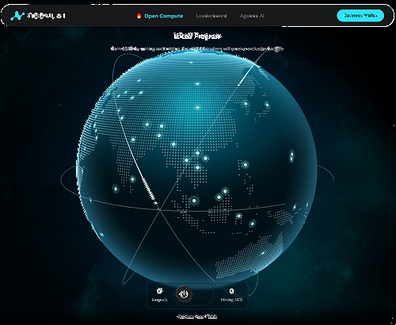
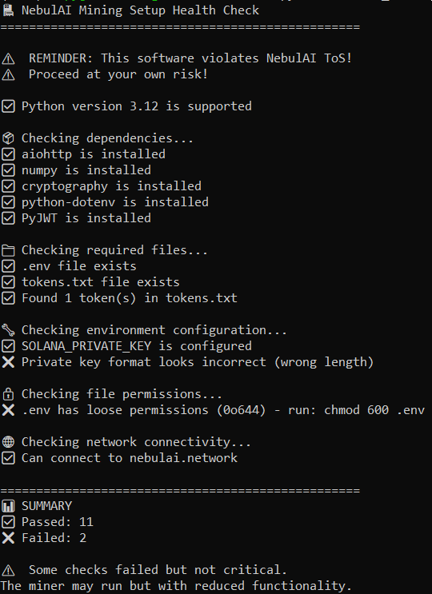
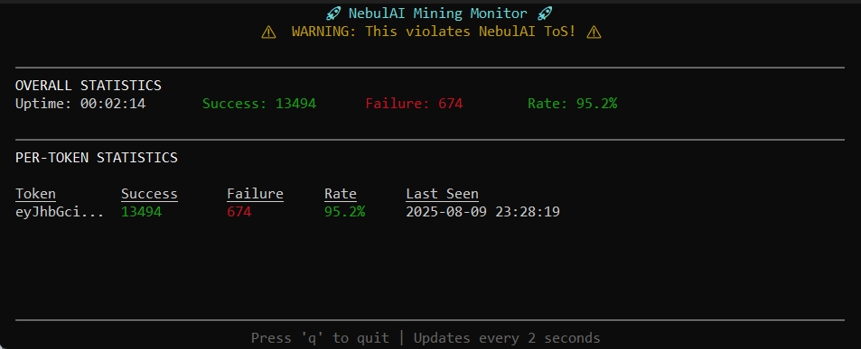
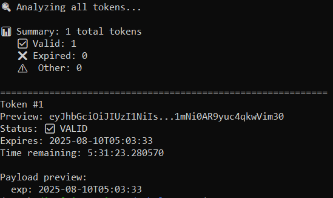

# NebulAI Mining Automation Suite

[](https://bit.ly/nebulai_opencompute)

**Created by [DiPY™](https://x.com/BlockClaimed) for the blockchain development community**

**Credit goes to [borckesd](https://github.com/borckesd/nebulai-miner)**

**🔗 Experience NebulAI:** [NebulAI Open Compute](https://bit.ly/nebulai_opencompute)

## 🚨 LEGAL DISCLAIMER 🚨

**THIS SOFTWARE VIOLATES NEBULAI'S TERMS OF SERVICE**

Using this software may result in:
- Immediate and permanent account suspension
- Loss of all mining rewards
- Potential legal action
- IP bans and device blacklisting

**USE AT YOUR OWN RISK - FOR EDUCATIONAL PURPOSES ONLY**

## Overview

This suite provides a comprehensive solution for automating NebulAI mining operations, including:
- Automatic JWT token refresh every 24 hours
- Secure credential storage with encryption
- Real-time performance monitoring
- Token management utilities
- Multi-token concurrent mining

## 📦 Files Included

### 🎯 **Core Components**
- **`nebulai_miner.py`** - Main automation script with adaptive rate limiting and error recovery
- **`monitor.py`** - Real-time terminal dashboard with live performance metrics
- **`token_utility.py`** - JWT token management tool for validation and cleanup
- **`health_check.py`** - Pre-flight system validation and connectivity testing

### 🛠 **Setup & Installation**
- **`installer.sh`** - One-click automated installer for Unix/Linux/macOS systems
- **`installer.bat`** - Windows PowerShell automated installer and setup script
- **`requirements.txt`** - Python dependencies with version specifications

### ⚙️ **Configuration Files**
- **`.env`** - Secure environment configuration for private keys and settings
- **`tokens.txt`** - Encrypted JWT token storage (one token per line)

### 📚 **Documentation**
- **`README.md`** - Complete setup guide, documentation, and legal disclaimers

## Quick Start

### 1. Prerequisites
- Python 3.8 or higher
- Solana wallet with private key access
- Valid NebulAI JWT tokens

### 2. Installation
```bash
# Clone the repository
git clone https://github.com/laldinpuia/NebulAI-Auto

# Create virtual environment (recommended)
python -m venv venv
source venv/bin/activate  # Linux/Mac
# venv\Scripts\activate   # Windows

# Install dependencies
pip install -r requirements.txt
```

### 3. Configuration
```bash
# Create your environment configuration file
nano .env  # or use your preferred editor
```

**Required Environment Variables (.env file):**
```env
SOLANA_PRIVATE_KEY=your_actual_private_key_here
LOG_LEVEL=INFO
TOKEN_REFRESH_HOURS=23
ENCRYPTION_ENABLED=true
MONITORING_PORT=8080
```

### 4. Add Tokens
```bash
# Method 1: Use token utility
python token_utility.py add --token "eyJhbGciOiJIUzI1NiIs..."

# Method 2: Create tokens.txt manually (one token per line)
```

### 5. Run the Suite
```bash
# Start mining
python nebulai_miner.py

# Monitor performance (optional, in separate terminal)
python monitor.py

# Check token status
python token_utility.py check
```

## System Health Check

Before running the miner, use the health check utility to verify your setup:

```bash
python health_check.py
```



The health check validates:
- Python version compatibility
- Required dependencies installation
- Environment configuration
- Token file existence
- Network connectivity to NebulAI
- File permissions security

## Real-Time Monitoring

Monitor your mining operations with the built-in dashboard:

```bash
python monitor.py
```



The monitor displays:
- Overall mining statistics and uptime
- Success/failure rates in real-time
- Per-token performance metrics
- Last activity timestamps
- Live success rate calculations

## Token Management

```bash
# Check all tokens for validity
python token_utility.py check

# Remove expired tokens
python token_utility.py clean

# Add a new token
python token_utility.py add --token "eyJ..."

# Decode token payload
python token_utility.py decode --token "eyJ..."
```



The token utility provides:
- Token validity verification
- Expiration date analysis
- Time remaining calculations
- Payload inspection
- Batch token management

## Security Features

- **Encrypted Storage**: JWT tokens and private keys encrypted at rest
- **Environment Variables**: Sensitive data in `.env` (not in code)
- **File Permissions**: Automatic restriction of sensitive files
- **No Hardcoded Secrets**: All credentials externally configured

**Secure File Permissions (Unix/Linux/Mac only):**
```bash
chmod 600 .env
chmod 600 .token_encryption_key
```
*Windows users can skip this step - file permissions are handled automatically.*

## Architecture

```
┌─────────────────┐     ┌──────────────┐     ┌─────────────────┐
│   tokens.txt    │────▶│  Main Miner  │────▶│  NebulAI API   │
└─────────────────┘     └──────────────┘     └─────────────────┘
         │                      │
         │                      │ Logs
         ▼                      ▼
┌─────────────────┐     ┌──────────────┐
│  Token Utility  │     │   Monitor    │
└─────────────────┘     └──────────────┘
```

## Key Features

- **Concurrent Processing**: Multiple tokens mined simultaneously
- **Adaptive Delays**: Automatic adjustment based on success rates
- **Circuit Breakers**: Prevents excessive failures
- **Automatic Token Refresh**: Attempts refresh 1 hour before expiry
- **Error Recovery**: Exponential backoff and recovery patterns
- **Statistics Tracking**: Success rates and performance metrics
- **Comprehensive Logging**: Debug information in `nebulai_miner.log`

## Troubleshooting

### Common Issues

**Authentication failures**
- Tokens may be expired or invalid
- Token refresh mechanism is theoretical

**High failure rate**
- Account may be flagged for automation
- NebulAI may have anti-automation measures

**Script won't start**
- Check dependencies: `pip install -r requirements.txt`
- Verify `.env` configuration
- Ensure `tokens.txt` exists with valid tokens

**File not found errors**
- Create missing files: `.env`, `tokens.txt`
- Check file permissions and paths

## Important Limitations

1. **Browser Requirement**: NebulAI requires browser-based mining which this cannot replicate
2. **Theoretical Implementation**: Token refresh mechanism is hypothetical
3. **Detection Risk**: Platform actively monitors for automation
4. **ToS Violation**: Usage violates platform terms of service

## Educational Value

This project demonstrates:
- Async Python programming patterns
- JWT token handling and validation
- Solana wallet integration concepts
- Secure credential management
- Real-time monitoring systems
- Error handling and recovery patterns

## Alternative Recommendations

Instead of violating ToS, consider:
- Manual daily activation as intended
- Building compliant DeFi applications
- Contributing to open-source blockchain projects
- Learning Solana development for legitimate use cases

## Support

This script is provided as-is for educational purposes. No support is available for ToS violations or account issues resulting from its use.

## License

This code is provided AS-IS with no warranties. The authors are not responsible for any consequences of using this software.

---

**Final Warning: DO NOT USE THIS IN PRODUCTION**

This software violates NebulAI's Terms of Service and is provided solely for educational demonstration of blockchain authentication, Python async programming, and security best practices.